# Thailand Meteorological Analyzer

[](https://www.python.org/)
[](https://streamlit.io/)
[](https://pandas.pydata.org/)
[](https://plotly.com/python/)
[](https://dev.meteostat.net/python/)
[](LICENSE)

An interactive Streamlit application that collects, cleans, and visualizes Thai
weather-station data from the [Meteostat](https://dev.meteostat.net/) network and
overlays it with NOAA's **Oceanic Niño Index (ONI)** to support
El Niño / La Niña climate analysis. The user interface is in Thai (ภาษาไทย).

> **Disclaimer:** This is an independent project and is **not** an official
> website of any government agency.

## Highlights

- **Region + station-level selection** — pick whole regions or drill down to
  individual stations, with a *Select All* shortcut.
- **Resilient parallel fetching** — stations are fetched concurrently with
  retry/back-off and an automatic **nearest-station fallback** when a primary
  station has no data.
- **Automated cleaning** — per-station chronological interpolation of short gaps,
  daily/monthly aggregation, and edge-gap filling.
- **ONI integration** — merges NOAA ONI values by month and classifies
  El Niño / La Niña intensity.
- **Interactive output** — station map, per-station time series, a monthly
  climate-vs-ONI chart, and one-click **CSV / Excel** export.

## Project Structure

```text
.
├── app.py               # Streamlit entrypoint, UI flow, charts, exports
├── weather_fetcher.py   # Station loading + Meteostat & NOAA ONI fetching
├── data_processing.py   # Cleaning, interpolation, aggregation, ONI labels, Excel export
├── ui_components.py      # Reusable region/station selector widgets
├── stations.json         # Master metadata for 127 Thai stations (6 regions)
├── assets/               # TMD / NOAA logos
└── .streamlit/
    ├── config.toml       # Theme + headless server settings
    └── style.css         # Custom design-system styling
```

## Quick Start

Requires **Python 3.10+** (developed and tested on 3.12).

```bash
# 1) Create and activate a virtual environment
python3 -m venv .venv
source .venv/bin/activate

# 2) Install dependencies
pip install -r requirements.txt

# 3) Launch the app (run from the repository root)
streamlit run app.py
```

The app opens in your browser at `http://localhost:8501`.

## How It Works

1. **Select inputs** — choose one or more regions, optionally narrow to specific
   stations, and pick a date range (data is available from 1950 onward).
2. **Fetch** — `fetch_stations_parallel` queries Meteostat for each selected
   station using a thread pool (up to 12 workers). Each station is retried up to
   3 times with exponential back-off; if it still returns nothing, the nearest
   Meteostat station is used as a fallback.
3. **Clean & aggregate** — raw daily records are normalized, short gaps are
   linearly interpolated per station (up to 14 days, in date order), then
   aggregated to daily and finally monthly statistics.
4. **Merge ONI** — NOAA ONI values are scraped, reshaped from seasonal to
   monthly, merged onto the monthly table, and labeled by intensity.
5. **Visualize & export** — results render as charts and tables and can be
   downloaded as CSV or Excel.

```mermaid
flowchart LR
    A[User input: regions + stations + date range] --> B[Load stations.json]
    B --> C[Filter by region and selected station IDs]
    C --> D[Parallel Meteostat fetch + retry + nearest-station fallback]
    D --> E[Normalize and clean raw daily data]
    E --> F[Per-station interpolation of short gaps]
    F --> G[Daily then monthly aggregation]
    G --> H[Merge NOAA ONI index]
    H --> I[Classify ONI intensity]
    I --> J[Render charts + export CSV/Excel]
```



## Monthly Output Columns

| Field | Meaning | Unit |
|---|---|---|
| `year_month` | Year and month of the record | `YYYY-MM` |
| `temp_mean` | Mean monthly temperature | °C |
| `tmax_max` | Monthly maximum of daily max temperature | °C |
| `tmin_min` | Monthly minimum of daily min temperature | °C |
| `rhum_mean` | Mean monthly relative humidity | % |
| `wspd_mean` | Mean monthly wind speed | km/h |
| `pres_mean` | Mean monthly sea-level pressure | hPa |
| `prcp_sum` | Total monthly precipitation | mm |
| `rainy_days` | Count of days with `prcp > 0.5 mm` | days |
| `ONI_Index` | NOAA ONI value for that month | – |
| `ONI_Label` | El Niño / La Niña intensity category (see below) | – |

> Indicators that are entirely unavailable for the selected stations and period
> (commonly `pres_mean` or `rhum_mean`) are left blank rather than guessed, and
> the app reports which ones were incomplete.

## ONI Intensity Classification

`ONI_Label` is derived from `ONI_Index` in `data_processing.classify_oni`:

| ONI range | Category |
|---|---|
| `≥ 2.0` | El Niño — Very Strong |
| `1.5 … 1.9` | El Niño — Strong |
| `1.0 … 1.4` | El Niño — Moderate |
| `0.5 … 0.9` | El Niño — Weak |
| `-0.4 … 0.4` | Neutral |
| `-0.9 … -0.5` | La Niña — Weak |
| `-1.4 … -1.0` | La Niña — Moderate |
| `-1.9 … -1.5` | La Niña — Strong |
| `≤ -2.0` | La Niña — Very Strong |

## Configuration

- **`stations.json`** — the station master file. Each entry is keyed by WMO ID
  and must contain `name`, `address`, `lat`, `lon`, and `region`. Entries missing
  any required key (or with non-numeric coordinates) are skipped on load. The file
  is resolved relative to the source code, so the app works from any working
  directory.
- **`.streamlit/config.toml`** — theme colors and headless server mode.
- **`.streamlit/style.css`** — optional custom styling; the app falls back to the
  default Streamlit theme if it is missing.

## Data Sources & Attribution

- **Weather data:** [Meteostat](https://dev.meteostat.net/), provided under the
  [Creative Commons Attribution 4.0 International License](https://creativecommons.org/licenses/by/4.0/).
- **ONI data:** [NOAA Climate Prediction Center](https://www.cpc.ncep.noaa.gov/products/analysis_monitoring/ensostuff/ONI_v5.php).

## Notes & Caveats

- **Network required:** Meteostat and NOAA must be reachable for a full run.
- **Default fetch is large:** all regions and stations are pre-selected, so a
  default run fetches all 127 stations. Narrow the selection for faster results.
- **TLS verification is disabled** for outbound requests (`ssl` is patched
  globally and NOAA is fetched with `verify=False`) to work around certificate
  issues on the NOAA endpoint and some macOS Python builds. Keep this in mind if
  you deploy in a security-sensitive environment.

## Troubleshooting

```bash
# Recreate the environment cleanly if dependencies break
rm -rf .venv
python3 -m venv .venv
source .venv/bin/activate
pip install -r requirements.txt
```

- **`ModuleNotFoundError: No module named 'meteostat.api'`** — the `meteostat`
  install is incomplete (often an interrupted install). Reinstall it:
  `pip install --force-reinstall --no-cache-dir meteostat==2.1.4`.
- **Missing station file** — add a valid `stations.json` at the project root.
- **Frequent timeouts / fetch failures** — reduce the date range or the number of
  selected stations and retry; the per-station log expander shows the cause for
  each station.

## License

Released under the [MIT License](LICENSE).
